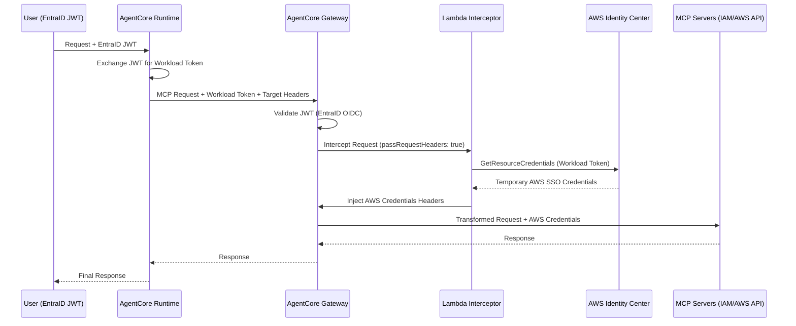

# Design Document: Bedrock AgentCore Terraform Infrastructure

## Overview

This design specifies a production-ready Terraform infrastructure for deploying Amazon Bedrock AgentCore with Token Propagation and Just-in-Time (JIT) Credential Generation. The system enables secure, multi-account AWS resource access through a Gateway-Runtime architecture where EntraID JWT tokens are exchanged for AgentCore Workload Tokens, then transformed into temporary AWS SSO credentials via a Lambda Request Interceptor. The infrastructure provisions IAM Identity Center integration, Bedrock AgentCore identity components, Lambda interceptor deployment, and Gateway routing configuration with MCP server targets.

## Main Algorithm/Workflow



## Core Interfaces/Types

```pascal
STRUCTURE TerraformVariables
  aws_region: String
  aws_account_id: String
  entra_tenant_id: String
  entra_oidc_issuer_url: String
  entra_audience: String
  idc_instance_arn: String
  workload_identity_name: String
  credential_provider_name: String
  gateway_name: String
  interceptor_lambda_name: String
END STRUCTURE

STRUCTURE IAMRoleConfig
  role_name: String
  assume_role_policy: JSON
  inline_policies: List<PolicyDocument>
  managed_policy_arns: List<String>
END STRUCTURE

STRUCTURE BedrockIdentityConfig
  workload_identity_name: String
  credential_provider_name: String
  credential_provider_type: Enum(IAM_IDENTITY_CENTER)
  idc_instance_arn: String
END STRUCTURE

STRUCTURE GatewayConfig
  gateway_name: String
  inbound_authorizer: AuthorizerConfig
  interceptor_configuration: InterceptorConfig
  targets: List<TargetConfig>
END STRUCTURE

STRUCTURE AuthorizerConfig
  type: Enum(CUSTOM_JWT)
  discovery_url: String
  allowed_audiences: List<String>
END STRUCTURE

STRUCTURE InterceptorConfig
  interception_points: List<Enum(REQUEST, RESPONSE)>
  lambda_arn: String
  pass_request_headers: Boolean
END STRUCTURE

STRUCTURE TargetConfig
  target_name: String
  endpoint_url: String
  mcp_server_type: Enum(IAM_MCP, AWS_API_MCP)
END STRUCTURE
```


## Key Functions with Formal Specifications

### Function 1: createIDCTrustedTokenIssuer()

```pascal
FUNCTION createIDCTrustedTokenIssuer(config: TerraformVariables): TrustedTokenIssuerARN
```

**Preconditions:**
- `config.entra_tenant_id` is non-empty valid UUID
- `config.entra_oidc_issuer_url` is valid HTTPS URL ending with tenant ID
- `config.idc_instance_arn` is valid ARN format for IAM Identity Center instance
- IAM Identity Center instance exists and is active

**Postconditions:**
- Returns valid ARN for created Trusted Token Issuer
- TTI is configured with EntraID OIDC discovery endpoint
- TTI is associated with specified IDC instance
- TTI status is ACTIVE

**Loop Invariants:** N/A

### Function 2: createRuntimeExecutionRole()

```pascal
FUNCTION createRuntimeExecutionRole(config: TerraformVariables): IAMRoleARN
```

**Preconditions:**
- `config.aws_account_id` is valid 12-digit AWS account ID
- `config.workload_identity_name` is non-empty string
- Bedrock AgentCore service principal exists in region

**Postconditions:**
- Returns valid IAM Role ARN
- Role has trust policy allowing Bedrock AgentCore Runtime service
- Role has inline policy granting `bedrock-agentcore:GetWorkloadAccessTokenForJwt` permission
- Role has condition restricting to specific workload identity name
- No mutations to input parameters

**Loop Invariants:** N/A

### Function 3: createInterceptorExecutionRole()

```pascal
FUNCTION createInterceptorExecutionRole(config: TerraformVariables): IAMRoleARN
```

**Preconditions:**
- `config.aws_account_id` is valid 12-digit AWS account ID
- Lambda service principal exists

**Postconditions:**
- Returns valid IAM Role ARN
- Role has trust policy allowing Lambda service
- Role has inline policy granting `bedrock-agentcore:GetResourceCredentials` permission
- Role has AWS managed policy `AWSLambdaBasicExecutionRole` attached
- No side effects on input parameters

**Loop Invariants:** N/A

### Function 4: createWorkloadIdentity()

```pascal
FUNCTION createWorkloadIdentity(config: BedrockIdentityConfig): WorkloadIdentityARN
```

**Preconditions:**
- `config.workload_identity_name` is non-empty string matching pattern [a-zA-Z0-9-_]+
- Bedrock AgentCore service is available in target region

**Postconditions:**
- Returns valid Workload Identity ARN
- Workload Identity is created with specified name
- Identity is in ACTIVE state
- Identity can be referenced by Runtime for token exchange

**Loop Invariants:** N/A

### Function 5: createCredentialProvider()

```pascal
FUNCTION createCredentialProvider(config: BedrockIdentityConfig): CredentialProviderARN
```

**Preconditions:**
- `config.credential_provider_name` is non-empty string
- `config.idc_instance_arn` is valid and IDC instance exists
- `config.credential_provider_type` equals IAM_IDENTITY_CENTER

**Postconditions:**
- Returns valid Credential Provider ARN
- Provider is configured with IAM_IDENTITY_CENTER type
- Provider is mapped to specified IDC instance ARN
- Provider can be used by Interceptor for credential generation

**Loop Invariants:** N/A

### Function 6: deployInterceptorLambda()

```pascal
FUNCTION deployInterceptorLambda(
  lambda_code: String,
  execution_role_arn: String,
  config: TerraformVariables
): LambdaFunctionARN
```

**Preconditions:**
- `lambda_code` contains valid Python code with lambda_handler function
- `execution_role_arn` is valid IAM Role ARN with Lambda trust policy
- `config.interceptor_lambda_name` is non-empty string
- Lambda code includes boto3 client for bedrock-agentcore

**Postconditions:**
- Returns valid Lambda Function ARN
- Lambda is deployed with Python 3.12 runtime
- Lambda has execution role attached
- Lambda has environment variables configured (if needed)
- Lambda has resource-based policy allowing Bedrock Gateway invocation
- Function is in Active state

**Loop Invariants:** N/A

### Function 7: createGatewayWithInterceptor()

```pascal
FUNCTION createGatewayWithInterceptor(
  gateway_config: GatewayConfig,
  interceptor_arn: String
): GatewayARN
```

**Preconditions:**
- `gateway_config.gateway_name` is non-empty string
- `gateway_config.inbound_authorizer.discovery_url` is valid HTTPS URL
- `gateway_config.inbound_authorizer.allowed_audiences` is non-empty list
- `interceptor_arn` is valid Lambda Function ARN
- `gateway_config.interceptor_configuration.pass_request_headers` equals true
- `gateway_config.targets` contains at least one valid target configuration

**Postconditions:**
- Returns valid Gateway ARN
- Gateway is configured with CUSTOM_JWT inbound authorizer
- Gateway interceptor points to specified Lambda ARN
- Gateway interceptor has interceptionPoints set to ["REQUEST"]
- Gateway interceptor has passRequestHeaders set to true
- Gateway has routing targets configured for IAM and AWS API MCP servers
- Gateway is in ACTIVE state

**Loop Invariants:** N/A

### Function 8: configureGatewayTargets()

```pascal
FUNCTION configureGatewayTargets(
  gateway_arn: String,
  targets: List<TargetConfig>
): Boolean
```

**Preconditions:**
- `gateway_arn` is valid Gateway ARN
- `targets` is non-empty list
- Each target has valid endpoint_url (HTTPS)
- Each target has unique target_name

**Postconditions:**
- Returns true if all targets configured successfully
- Each target is registered with Gateway
- Target routing rules are active
- MCP protocol endpoints are accessible from Gateway

**Loop Invariants:**
- For each iteration: All previously configured targets remain valid and active
- Target count increases monotonically during configuration loop


## Algorithmic Pseudocode

### Main Infrastructure Provisioning Algorithm

```pascal
ALGORITHM provisionBedrockAgentCoreInfrastructure(config)
INPUT: config of type TerraformVariables
OUTPUT: infrastructure_state of type InfrastructureState

BEGIN
  ASSERT validateConfiguration(config) = true
  
  // Phase 1: Identity & Access Management
  state ← initializeState()
  
  // Step 1.1: Configure IAM Identity Center Trusted Token Issuer
  tti_arn ← createIDCTrustedTokenIssuer(config)
  state.tti_arn ← tti_arn
  ASSERT tti_arn IS NOT NULL AND isValidARN(tti_arn)
  
  // Step 1.2: Create Runtime Execution Role
  runtime_role_arn ← createRuntimeExecutionRole(config)
  state.runtime_role_arn ← runtime_role_arn
  ASSERT runtime_role_arn IS NOT NULL AND hasPermission(runtime_role_arn, "bedrock-agentcore:GetWorkloadAccessTokenForJwt")
  
  // Step 1.3: Create Interceptor Execution Role
  interceptor_role_arn ← createInterceptorExecutionRole(config)
  state.interceptor_role_arn ← interceptor_role_arn
  ASSERT interceptor_role_arn IS NOT NULL AND hasPermission(interceptor_role_arn, "bedrock-agentcore:GetResourceCredentials")
  
  // Phase 2: Bedrock AgentCore Identity Setup
  identity_config ← buildIdentityConfig(config)
  
  // Step 2.1: Create Workload Identity
  workload_identity_arn ← createWorkloadIdentity(identity_config)
  state.workload_identity_arn ← workload_identity_arn
  ASSERT workload_identity_arn IS NOT NULL AND isActive(workload_identity_arn)
  
  // Step 2.2: Create Credential Provider
  credential_provider_arn ← createCredentialProvider(identity_config)
  state.credential_provider_arn ← credential_provider_arn
  ASSERT credential_provider_arn IS NOT NULL AND isLinkedToIDC(credential_provider_arn, config.idc_instance_arn)
  
  // Phase 3: Lambda Interceptor Deployment
  lambda_code ← loadInterceptorCode()
  
  // Step 3.1: Package and Deploy Lambda
  lambda_arn ← deployInterceptorLambda(lambda_code, interceptor_role_arn, config)
  state.lambda_arn ← lambda_arn
  ASSERT lambda_arn IS NOT NULL AND isDeployed(lambda_arn)
  
  // Step 3.2: Grant Gateway Invocation Permission
  permission_granted ← grantGatewayInvocationPermission(lambda_arn, config.aws_account_id)
  ASSERT permission_granted = true
  
  // Phase 4: Gateway Configuration
  gateway_config ← buildGatewayConfig(config, lambda_arn)
  
  // Step 4.1: Create Gateway with Interceptor
  gateway_arn ← createGatewayWithInterceptor(gateway_config, lambda_arn)
  state.gateway_arn ← gateway_arn
  ASSERT gateway_arn IS NOT NULL AND isActive(gateway_arn)
  
  // Step 4.2: Configure Gateway Targets
  targets_configured ← configureGatewayTargets(gateway_arn, gateway_config.targets)
  ASSERT targets_configured = true
  
  // Step 4.3: Verify End-to-End Configuration
  verification_result ← verifyInfrastructure(state)
  ASSERT verification_result.all_checks_passed = true
  
  state.status ← "PROVISIONED"
  state.timestamp ← getCurrentTimestamp()
  
  RETURN state
END
```

**Preconditions:**
- config contains all required fields with valid values
- AWS credentials are configured with sufficient permissions
- Target AWS region supports Bedrock AgentCore service
- IAM Identity Center instance exists and is configured

**Postconditions:**
- All infrastructure components are provisioned and active
- Runtime can exchange EntraID JWT for Workload Token
- Gateway can validate JWT and route to Interceptor
- Interceptor can generate JIT credentials via IDC
- MCP servers are accessible through Gateway
- state.status equals "PROVISIONED"

**Loop Invariants:**
- All provisioned resources remain in valid state throughout execution
- State object accumulates ARNs monotonically
- No previously created resources are deleted during provisioning

### IAM Role Creation Algorithm

```pascal
ALGORITHM createRuntimeExecutionRole(config)
INPUT: config of type TerraformVariables
OUTPUT: role_arn of type String

BEGIN
  // Step 1: Build trust policy document
  trust_policy ← {
    "Version": "2012-10-17",
    "Statement": [{
      "Effect": "Allow",
      "Principal": {
        "Service": "bedrock-agentcore.amazonaws.com"
      },
      "Action": "sts:AssumeRole"
    }]
  }
  
  // Step 2: Build inline policy for token exchange
  token_exchange_policy ← {
    "Version": "2012-10-17",
    "Statement": [{
      "Effect": "Allow",
      "Action": "bedrock-agentcore:GetWorkloadAccessTokenForJwt",
      "Resource": buildWorkloadIdentityARN(config.aws_account_id, config.aws_region, config.workload_identity_name),
      "Condition": {
        "StringEquals": {
          "bedrock-agentcore:WorkloadName": config.workload_identity_name
        }
      }
    }]
  }
  
  // Step 3: Create IAM role
  role_name ← config.workload_identity_name + "-runtime-role"
  role ← createIAMRole(role_name, trust_policy)
  ASSERT role IS NOT NULL
  
  // Step 4: Attach inline policy
  attachInlinePolicy(role.arn, "TokenExchangePolicy", token_exchange_policy)
  
  // Step 5: Wait for role propagation
  waitForRolePropagation(role.arn, 10)
  
  RETURN role.arn
END
```

**Preconditions:**
- config.aws_account_id is valid 12-digit account ID
- config.aws_region is valid AWS region code
- config.workload_identity_name is non-empty string
- Caller has iam:CreateRole and iam:PutRolePolicy permissions

**Postconditions:**
- IAM role exists with specified name
- Role has trust policy allowing Bedrock AgentCore service
- Role has inline policy with GetWorkloadAccessTokenForJwt permission
- Role ARN is returned in valid format
- Role is propagated across AWS infrastructure

**Loop Invariants:** N/A

### Lambda Interceptor Deployment Algorithm

```pascal
ALGORITHM deployInterceptorLambda(lambda_code, execution_role_arn, config)
INPUT: lambda_code of type String, execution_role_arn of type String, config of type TerraformVariables
OUTPUT: lambda_arn of type String

BEGIN
  ASSERT lambda_code IS NOT NULL AND length(lambda_code) > 0
  ASSERT isValidARN(execution_role_arn)
  
  // Step 1: Package Lambda code
  zip_package ← createZipPackage(lambda_code, "lambda_function.py")
  ASSERT zip_package.size > 0
  
  // Step 2: Create Lambda function
  lambda_config ← {
    "FunctionName": config.interceptor_lambda_name,
    "Runtime": "python3.12",
    "Handler": "lambda_function.lambda_handler",
    "Role": execution_role_arn,
    "Code": zip_package,
    "Timeout": 30,
    "MemorySize": 256,
    "Environment": {
      "Variables": {
        "AWS_REGION": config.aws_region,
        "CREDENTIAL_PROVIDER_NAME": config.credential_provider_name
      }
    }
  }
  
  lambda_function ← createLambdaFunction(lambda_config)
  ASSERT lambda_function IS NOT NULL
  ASSERT lambda_function.State = "Active"
  
  // Step 3: Add resource-based policy for Gateway invocation
  statement_id ← "AllowBedrockGatewayInvoke"
  principal ← "bedrock-agentcore.amazonaws.com"
  
  addLambdaPermission(
    lambda_function.arn,
    statement_id,
    "lambda:InvokeFunction",
    principal,
    config.aws_account_id
  )
  
  // Step 4: Wait for Lambda to be ready
  waitForLambdaReady(lambda_function.arn, 30)
  
  RETURN lambda_function.arn
END
```

**Preconditions:**
- lambda_code contains valid Python code with lambda_handler function
- execution_role_arn is valid IAM role with Lambda trust policy
- config.interceptor_lambda_name is unique in account/region
- Caller has lambda:CreateFunction and lambda:AddPermission permissions

**Postconditions:**
- Lambda function is created and in Active state
- Function has execution role attached
- Function has resource-based policy allowing Gateway invocation
- Function ARN is returned
- Function is ready to process requests

**Loop Invariants:** N/A


### Gateway Configuration Algorithm

```pascal
ALGORITHM createGatewayWithInterceptor(gateway_config, interceptor_arn)
INPUT: gateway_config of type GatewayConfig, interceptor_arn of type String
OUTPUT: gateway_arn of type String

BEGIN
  ASSERT gateway_config IS NOT NULL
  ASSERT isValidARN(interceptor_arn)
  ASSERT gateway_config.interceptor_configuration.pass_request_headers = true
  
  // Step 1: Build inbound authorizer configuration
  authorizer_config ← {
    "type": "CUSTOM_JWT",
    "jwtConfiguration": {
      "issuer": gateway_config.inbound_authorizer.discovery_url,
      "audience": gateway_config.inbound_authorizer.allowed_audiences
    }
  }
  
  // Step 2: Build interceptor configuration
  interceptor_config ← {
    "interceptionPoints": ["REQUEST"],
    "lambdaArn": interceptor_arn,
    "passRequestHeaders": true
  }
  
  // Step 3: Create Gateway
  gateway ← createBedrockGateway({
    "name": gateway_config.gateway_name,
    "inboundAuthorizer": authorizer_config,
    "interceptorConfiguration": interceptor_config
  })
  
  ASSERT gateway IS NOT NULL
  ASSERT gateway.status = "CREATING" OR gateway.status = "ACTIVE"
  
  // Step 4: Wait for Gateway to become active
  waitForGatewayActive(gateway.arn, 300)
  
  // Step 5: Verify interceptor configuration
  retrieved_config ← getGatewayConfiguration(gateway.arn)
  ASSERT retrieved_config.interceptorConfiguration.passRequestHeaders = true
  ASSERT retrieved_config.interceptorConfiguration.lambdaArn = interceptor_arn
  
  RETURN gateway.arn
END
```

**Preconditions:**
- gateway_config contains valid authorizer and interceptor settings
- interceptor_arn points to deployed Lambda function
- gateway_config.inbound_authorizer.discovery_url is accessible HTTPS endpoint
- Caller has bedrock-agentcore:CreateGateway permission

**Postconditions:**
- Gateway is created and in ACTIVE state
- Gateway has CUSTOM_JWT authorizer configured with EntraID
- Gateway has interceptor pointing to Lambda with passRequestHeaders: true
- Gateway ARN is returned
- Gateway can accept requests with JWT validation

**Loop Invariants:** N/A

### Target Configuration Algorithm

```pascal
ALGORITHM configureGatewayTargets(gateway_arn, targets)
INPUT: gateway_arn of type String, targets of type List<TargetConfig>
OUTPUT: success of type Boolean

BEGIN
  ASSERT isValidARN(gateway_arn)
  ASSERT targets IS NOT NULL AND length(targets) > 0
  
  configured_count ← 0
  
  // Loop through each target and configure routing
  FOR each target IN targets DO
    ASSERT allPreviousTargetsConfigured(configured_count)
    
    // Step 1: Validate target configuration
    IF NOT isValidHTTPSUrl(target.endpoint_url) THEN
      RETURN false
    END IF
    
    // Step 2: Create target routing rule
    routing_rule ← {
      "targetName": target.target_name,
      "endpointUrl": target.endpoint_url,
      "protocol": "MCP",
      "mcpServerType": target.mcp_server_type
    }
    
    // Step 3: Add target to Gateway
    result ← addGatewayTarget(gateway_arn, routing_rule)
    
    IF result.success = false THEN
      RETURN false
    END IF
    
    configured_count ← configured_count + 1
    ASSERT configured_count = countConfiguredTargets(gateway_arn)
  END FOR
  
  // Step 4: Verify all targets are active
  FOR each target IN targets DO
    target_status ← getTargetStatus(gateway_arn, target.target_name)
    IF target_status ≠ "ACTIVE" THEN
      RETURN false
    END IF
  END FOR
  
  RETURN true
END
```

**Preconditions:**
- gateway_arn is valid and Gateway is in ACTIVE state
- targets list is non-empty
- Each target has unique target_name
- Each target.endpoint_url is valid HTTPS URL

**Postconditions:**
- All targets are configured and ACTIVE
- Gateway can route requests to all configured targets
- Returns true if all targets configured successfully
- No partial configuration state (all or nothing)

**Loop Invariants:**
- All previously configured targets remain ACTIVE
- configured_count equals number of successfully added targets
- No duplicate target names exist in Gateway configuration

### Credential Exchange Algorithm (Lambda Interceptor)

```pascal
ALGORITHM interceptAndInjectCredentials(event, context)
INPUT: event of type GatewayEvent, context of type LambdaContext
OUTPUT: transformed_response of type InterceptorResponse

BEGIN
  // Step 1: Extract headers from Gateway request
  headers ← event.headers
  ASSERT headers IS NOT NULL
  
  workload_token ← extractBearerToken(headers.authorization)
  target_account ← headers["x-target-account-id"]
  target_role ← headers["x-target-role-name"]
  
  ASSERT workload_token IS NOT NULL AND length(workload_token) > 0
  ASSERT target_account IS NOT NULL AND isValidAccountId(target_account)
  ASSERT target_role IS NOT NULL AND length(target_role) > 0
  
  // Step 2: Call Bedrock AgentCore to get resource credentials
  agentcore_client ← createBedrockAgentCoreClient(event.region)
  
  credential_request ← {
    "workloadIdentityToken": workload_token,
    "credentialProviderName": getCredentialProviderName(),
    "targetAccountId": target_account,
    "targetRoleName": target_role
  }
  
  credential_response ← agentcore_client.getResourceCredentials(credential_request)
  
  ASSERT credential_response IS NOT NULL
  ASSERT credential_response.credentials IS NOT NULL
  
  aws_credentials ← credential_response.credentials
  
  // Step 3: Validate received credentials
  ASSERT aws_credentials.accessKeyId IS NOT NULL
  ASSERT aws_credentials.secretAccessKey IS NOT NULL
  ASSERT aws_credentials.sessionToken IS NOT NULL
  
  // Step 4: Build transformed request with injected credentials
  transformed_headers ← {
    "x-aws-access-key-id": aws_credentials.accessKeyId,
    "x-aws-secret-access-key": aws_credentials.secretAccessKey,
    "x-aws-session-token": aws_credentials.sessionToken
  }
  
  // Step 5: Return interceptor response
  response ← {
    "interceptorOutputVersion": "1.0",
    "mcp": {
      "transformedGatewayRequest": {
        "headers": transformed_headers,
        "body": event.body
      }
    }
  }
  
  RETURN response
END
```

**Preconditions:**
- event.headers contains authorization header with valid Workload Token
- event.headers contains x-target-account-id with valid AWS account ID
- event.headers contains x-target-role-name with valid IAM role name
- Lambda has IAM permissions for bedrock-agentcore:GetResourceCredentials
- Credential Provider is configured and linked to IDC

**Postconditions:**
- Returns valid InterceptorResponse with transformed headers
- Transformed headers contain valid AWS temporary credentials
- Original request body is preserved
- Credentials are valid for target account and role
- No logging of sensitive credential values

**Loop Invariants:** N/A


## Example Usage

### Terraform Module Structure

```hcl
// Example 1: Root module configuration
module "bedrock_agentcore_infrastructure" {
  source = "./modules/bedrock-agentcore"
  
  aws_region              = "us-east-1"
  aws_account_id          = "123456789012"
  entra_tenant_id         = "a1b2c3d4-e5f6-7890-abcd-ef1234567890"
  entra_oidc_issuer_url   = "https://login.microsoftonline.com/a1b2c3d4-e5f6-7890-abcd-ef1234567890/v2.0"
  entra_audience          = "api://bedrock-agentcore-gateway"
  idc_instance_arn        = "arn:aws:sso:::instance/ssoins-1234567890abcdef"
  workload_identity_name  = "my-strands-agent"
  credential_provider_name = "aws-idc-provider"
  gateway_name            = "agentcore-gateway"
  interceptor_lambda_name = "agentcore-interceptor"
  
  mcp_targets = [
    {
      name     = "iam-mcp-server"
      endpoint = "https://internal-iam-mcp.example.com/mcp"
      type     = "IAM_MCP"
    },
    {
      name     = "aws-api-mcp-server"
      endpoint = "https://internal-aws-api-mcp.example.com/mcp"
      type     = "AWS_API_MCP"
    }
  ]
}

// Example 2: Accessing outputs
output "gateway_endpoint" {
  value = module.bedrock_agentcore_infrastructure.gateway_endpoint_url
}

output "workload_identity_arn" {
  value = module.bedrock_agentcore_infrastructure.workload_identity_arn
}

output "runtime_role_arn" {
  value = module.bedrock_agentcore_infrastructure.runtime_execution_role_arn
}
```

### IAM Role Resource Definition

```hcl
// Example 3: Runtime execution role
resource "aws_iam_role" "runtime_execution_role" {
  name = "${var.workload_identity_name}-runtime-role"
  
  assume_role_policy = jsonencode({
    Version = "2012-10-17"
    Statement = [{
      Effect = "Allow"
      Principal = {
        Service = "bedrock-agentcore.amazonaws.com"
      }
      Action = "sts:AssumeRole"
    }]
  })
  
  inline_policy {
    name = "TokenExchangePolicy"
    policy = jsonencode({
      Version = "2012-10-17"
      Statement = [{
        Effect = "Allow"
        Action = "bedrock-agentcore:GetWorkloadAccessTokenForJwt"
        Resource = "arn:aws:bedrock-agentcore:${var.aws_region}:${var.aws_account_id}:workload-identity/${var.workload_identity_name}"
        Condition = {
          StringEquals = {
            "bedrock-agentcore:WorkloadName" = var.workload_identity_name
          }
        }
      }]
    })
  }
}

// Example 4: Interceptor execution role
resource "aws_iam_role" "interceptor_execution_role" {
  name = "${var.interceptor_lambda_name}-role"
  
  assume_role_policy = jsonencode({
    Version = "2012-10-17"
    Statement = [{
      Effect = "Allow"
      Principal = {
        Service = "lambda.amazonaws.com"
      }
      Action = "sts:AssumeRole"
    }]
  })
  
  inline_policy {
    name = "CredentialGenerationPolicy"
    policy = jsonencode({
      Version = "2012-10-17"
      Statement = [{
        Effect = "Allow"
        Action = "bedrock-agentcore:GetResourceCredentials"
        Resource = "*"
      }]
    })
  }
  
  managed_policy_arns = [
    "arn:aws:iam::aws:policy/service-role/AWSLambdaBasicExecutionRole"
  ]
}
```

### Lambda Function Deployment

```hcl
// Example 5: Package and deploy interceptor Lambda
data "archive_file" "interceptor_lambda_zip" {
  type        = "zip"
  source_file = "${path.module}/lambda/interceptor.py"
  output_path = "${path.module}/lambda/interceptor.zip"
}

resource "aws_lambda_function" "interceptor" {
  filename         = data.archive_file.interceptor_lambda_zip.output_path
  function_name    = var.interceptor_lambda_name
  role            = aws_iam_role.interceptor_execution_role.arn
  handler         = "interceptor.lambda_handler"
  source_code_hash = data.archive_file.interceptor_lambda_zip.output_base64sha256
  runtime         = "python3.12"
  timeout         = 30
  memory_size     = 256
  
  environment {
    variables = {
      AWS_REGION               = var.aws_region
      CREDENTIAL_PROVIDER_NAME = var.credential_provider_name
    }
  }
}

// Example 6: Grant Gateway invocation permission
resource "aws_lambda_permission" "allow_gateway_invoke" {
  statement_id  = "AllowBedrockGatewayInvoke"
  action        = "lambda:InvokeFunction"
  function_name = aws_lambda_function.interceptor.function_name
  principal     = "bedrock-agentcore.amazonaws.com"
  source_account = var.aws_account_id
}
```

### Bedrock AgentCore Resources

```hcl
// Example 7: Workload Identity
resource "aws_bedrockagentcore_workload_identity" "agent_identity" {
  workload_identity_name = var.workload_identity_name
}

// Example 8: Credential Provider
resource "aws_bedrockagentcore_credential_provider" "idc_provider" {
  credential_provider_name = var.credential_provider_name
  credential_provider_type = "IAM_IDENTITY_CENTER"
  
  iam_identity_center_configuration {
    instance_arn = var.idc_instance_arn
  }
}

// Example 9: Gateway with Interceptor
resource "aws_bedrockagentcore_gateway" "main" {
  gateway_name = var.gateway_name
  
  inbound_authorizer {
    type = "CUSTOM_JWT"
    
    jwt_configuration {
      issuer   = var.entra_oidc_issuer_url
      audience = [var.entra_audience]
    }
  }
  
  interceptor_configuration {
    interception_points    = ["REQUEST"]
    lambda_arn            = aws_lambda_function.interceptor.arn
    pass_request_headers  = true
  }
  
  depends_on = [
    aws_lambda_permission.allow_gateway_invoke
  ]
}

// Example 10: Gateway Targets
resource "aws_bedrockagentcore_gateway_target" "iam_mcp" {
  gateway_arn  = aws_bedrockagentcore_gateway.main.arn
  target_name  = "iam-mcp-server"
  endpoint_url = "https://internal-iam-mcp.example.com/mcp"
  
  mcp_configuration {
    server_type = "IAM_MCP"
  }
}

resource "aws_bedrockagentcore_gateway_target" "aws_api_mcp" {
  gateway_arn  = aws_bedrockagentcore_gateway.main.arn
  target_name  = "aws-api-mcp-server"
  endpoint_url = "https://internal-aws-api-mcp.example.com/mcp"
  
  mcp_configuration {
    server_type = "AWS_API_MCP"
  }
}
```

### IAM Identity Center Configuration

```hcl
// Example 11: Trusted Token Issuer
resource "aws_identitystore_trusted_token_issuer" "entra_tti" {
  instance_arn = var.idc_instance_arn
  name         = "EntraID-TTI"
  
  trusted_token_issuer_configuration {
    oidc_jwt_configuration {
      issuer_url            = var.entra_oidc_issuer_url
      claim_attribute_path  = "sub"
      identity_store_attribute_path = "userName"
      jwks_retrieval_option = "OPEN_ID_DISCOVERY"
    }
  }
}
```

### Complete Workflow Example

```hcl
// Example 12: Complete infrastructure provisioning
terraform {
  required_version = ">= 1.5.0"
  
  required_providers {
    aws = {
      source  = "hashicorp/aws"
      version = "~> 5.0"
    }
    archive = {
      source  = "hashicorp/archive"
      version = "~> 2.4"
    }
  }
}

provider "aws" {
  region = var.aws_region
}

// Phase 1: IAM Roles
module "iam_roles" {
  source = "./modules/iam"
  
  workload_identity_name   = var.workload_identity_name
  interceptor_lambda_name  = var.interceptor_lambda_name
  aws_region              = var.aws_region
  aws_account_id          = var.aws_account_id
}

// Phase 2: Bedrock Identity
module "bedrock_identity" {
  source = "./modules/bedrock-identity"
  
  workload_identity_name   = var.workload_identity_name
  credential_provider_name = var.credential_provider_name
  idc_instance_arn        = var.idc_instance_arn
}

// Phase 3: Lambda Interceptor
module "lambda_interceptor" {
  source = "./modules/lambda"
  
  function_name            = var.interceptor_lambda_name
  execution_role_arn       = module.iam_roles.interceptor_role_arn
  credential_provider_name = var.credential_provider_name
  aws_region              = var.aws_region
  aws_account_id          = var.aws_account_id
}

// Phase 4: Gateway
module "gateway" {
  source = "./modules/gateway"
  
  gateway_name             = var.gateway_name
  entra_oidc_issuer_url    = var.entra_oidc_issuer_url
  entra_audience           = var.entra_audience
  interceptor_lambda_arn   = module.lambda_interceptor.lambda_arn
  mcp_targets             = var.mcp_targets
  
  depends_on = [
    module.lambda_interceptor
  ]
}

// Outputs
output "infrastructure_state" {
  value = {
    runtime_role_arn         = module.iam_roles.runtime_role_arn
    interceptor_role_arn     = module.iam_roles.interceptor_role_arn
    workload_identity_arn    = module.bedrock_identity.workload_identity_arn
    credential_provider_arn  = module.bedrock_identity.credential_provider_arn
    lambda_arn              = module.lambda_interceptor.lambda_arn
    gateway_arn             = module.gateway.gateway_arn
    gateway_endpoint_url    = module.gateway.gateway_endpoint_url
  }
}
```


## Correctness Properties

### Universal Quantification Statements

```pascal
// Property 1: IAM Role Trust Policy Correctness
PROPERTY iamRoleTrustPolicyCorrectness
  FORALL role IN [runtime_execution_role, interceptor_execution_role]:
    role.assume_role_policy IS NOT NULL AND
    role.assume_role_policy.Version = "2012-10-17" AND
    EXISTS statement IN role.assume_role_policy.Statement:
      statement.Effect = "Allow" AND
      statement.Action = "sts:AssumeRole" AND
      (statement.Principal.Service = "bedrock-agentcore.amazonaws.com" OR
       statement.Principal.Service = "lambda.amazonaws.com")
END PROPERTY

**Validates: Requirements 2.2, 3.2**

// Property 2: Permission Boundary Enforcement
PROPERTY permissionBoundaryEnforcement
  FORALL role IN [runtime_execution_role]:
    EXISTS policy IN role.inline_policies:
      policy.name = "TokenExchangePolicy" AND
      FORALL statement IN policy.Statement:
        statement.Action = "bedrock-agentcore:GetWorkloadAccessTokenForJwt" AND
        EXISTS condition IN statement.Condition:
          condition.StringEquals["bedrock-agentcore:WorkloadName"] = workload_identity_name
  AND
  FORALL role IN [interceptor_execution_role]:
    EXISTS policy IN role.inline_policies:
      policy.name = "CredentialGenerationPolicy" AND
      FORALL statement IN policy.Statement:
        statement.Action = "bedrock-agentcore:GetResourceCredentials"
END PROPERTY

**Validates: Requirements 2.3, 2.4, 2.5, 3.3**

// Property 3: Gateway Interceptor Configuration Correctness
PROPERTY gatewayInterceptorConfigCorrectness
  FORALL gateway IN deployed_gateways:
    gateway.interceptor_configuration IS NOT NULL AND
    gateway.interceptor_configuration.pass_request_headers = true AND
    gateway.interceptor_configuration.interception_points CONTAINS "REQUEST" AND
    isValidARN(gateway.interceptor_configuration.lambda_arn) AND
    lambdaExists(gateway.interceptor_configuration.lambda_arn)
END PROPERTY

**Validates: Requirements 8.5, 8.6, 8.7, 23.1**

// Property 4: JWT Authorizer Configuration Correctness
PROPERTY jwtAuthorizerConfigCorrectness
  FORALL gateway IN deployed_gateways:
    gateway.inbound_authorizer.type = "CUSTOM_JWT" AND
    gateway.inbound_authorizer.jwt_configuration.issuer IS NOT NULL AND
    isValidHTTPSUrl(gateway.inbound_authorizer.jwt_configuration.issuer) AND
    length(gateway.inbound_authorizer.jwt_configuration.audience) > 0 AND
    FORALL audience IN gateway.inbound_authorizer.jwt_configuration.audience:
      length(audience) > 0
END PROPERTY

**Validates: Requirements 8.2, 8.3, 8.4**

// Property 5: Lambda Permission Correctness
PROPERTY lambdaPermissionCorrectness
  FORALL lambda IN [interceptor_lambda]:
    EXISTS permission IN lambda.resource_based_policy:
      permission.principal = "bedrock-agentcore.amazonaws.com" AND
      permission.action = "lambda:InvokeFunction" AND
      permission.source_account = aws_account_id
END PROPERTY

**Validates: Requirements 7.1, 7.2, 7.3, 7.4**

// Property 6: Credential Provider Configuration Correctness
PROPERTY credentialProviderConfigCorrectness
  FORALL provider IN credential_providers:
    provider.credential_provider_type = "IAM_IDENTITY_CENTER" AND
    provider.iam_identity_center_configuration IS NOT NULL AND
    isValidARN(provider.iam_identity_center_configuration.instance_arn) AND
    idcInstanceExists(provider.iam_identity_center_configuration.instance_arn)
END PROPERTY

**Validates: Requirements 5.2, 5.3, 5.4**

// Property 7: Gateway Target Configuration Correctness
PROPERTY gatewayTargetConfigCorrectness
  FORALL gateway IN deployed_gateways:
    length(gateway.targets) >= 2 AND
    EXISTS target IN gateway.targets:
      target.target_name = "iam-mcp-server" AND
      isValidHTTPSUrl(target.endpoint_url) AND
      target.mcp_configuration.server_type = "IAM_MCP"
    AND
    EXISTS target IN gateway.targets:
      target.target_name = "aws-api-mcp-server" AND
      isValidHTTPSUrl(target.endpoint_url) AND
      target.mcp_configuration.server_type = "AWS_API_MCP"
END PROPERTY

**Validates: Requirements 9.1, 9.2, 9.3, 9.4**

// Property 8: Workload Identity Uniqueness
PROPERTY workloadIdentityUniqueness
  FORALL identity1, identity2 IN workload_identities:
    identity1 ≠ identity2 IMPLIES
      identity1.workload_identity_name ≠ identity2.workload_identity_name
END PROPERTY

**Validates: Requirement 4.2**

// Property 9: End-to-End Token Flow Correctness
PROPERTY endToEndTokenFlowCorrectness
  FORALL request IN gateway_requests:
    hasValidJWT(request.headers.authorization) AND
    hasWorkloadToken(request.headers.authorization) IMPLIES
      EXISTS interceptor_response:
        interceptor_response.mcp.transformedGatewayRequest.headers["x-aws-access-key-id"] IS NOT NULL AND
        interceptor_response.mcp.transformedGatewayRequest.headers["x-aws-secret-access-key"] IS NOT NULL AND
        interceptor_response.mcp.transformedGatewayRequest.headers["x-aws-session-token"] IS NOT NULL AND
        credentialsAreValid(interceptor_response.mcp.transformedGatewayRequest.headers)
END PROPERTY

**Validates: Requirements 10.2, 10.3, 10.4, 10.5, 11.5, 12.2, 12.3, 12.4**

// Property 10: Resource ARN Format Correctness
PROPERTY resourceARNFormatCorrectness
  FORALL resource IN [workload_identity, credential_provider, gateway, lambda_function]:
    isValidARN(resource.arn) AND
    resource.arn MATCHES "arn:aws:[a-z-]+:[a-z0-9-]+:[0-9]{12}:.+" AND
    extractAccountId(resource.arn) = aws_account_id AND
    extractRegion(resource.arn) = aws_region
END PROPERTY

**Validates: Requirements 14.1, 14.2, 14.3, 14.4**

// Property 11: Interceptor Header Propagation Correctness
PROPERTY interceptorHeaderPropagationCorrectness
  FORALL interceptor_event IN lambda_interceptor_events:
    interceptor_event.headers["x-target-account-id"] IS NOT NULL AND
    interceptor_event.headers["x-target-role-name"] IS NOT NULL IMPLIES
      credentialRequest.targetAccountId = interceptor_event.headers["x-target-account-id"] AND
      credentialRequest.targetRoleName = interceptor_event.headers["x-target-role-name"]
END PROPERTY

**Validates: Requirements 11.1, 11.2, 11.4, 23.2, 23.3**

// Property 12: Terraform State Consistency
PROPERTY terraformStateConsistency
  FORALL resource IN terraform_state.resources:
    resource.status = "ACTIVE" OR resource.status = "AVAILABLE" AND
    FORALL dependency IN resource.dependencies:
      dependency.status = "ACTIVE" OR dependency.status = "AVAILABLE" AND
      dependency.created_timestamp < resource.created_timestamp
END PROPERTY

**Validates: Requirements 15.1, 17.1, 17.2, 17.3, 17.4, 17.5**

// Property 13: Security Best Practices
PROPERTY securityBestPractices
  FORALL role IN iam_roles:
    NOT hasWildcardResource(role) OR hasStrictConditions(role) AND
    NOT hasAdministratorAccess(role) AND
  FORALL lambda IN lambda_functions:
    lambda.environment.variables DOES NOT CONTAIN sensitive_credentials AND
  FORALL gateway IN deployed_gateways:
    gateway.inbound_authorizer IS NOT NULL AND
    gateway.inbound_authorizer.type ≠ "NONE"
END PROPERTY

**Validates: Requirements 2.6, 3.5, 18.1, 18.2, 18.3, 18.4, 18.5**

// Property 14: Idempotency
PROPERTY infrastructureIdempotency
  FORALL deployment1, deployment2 IN terraform_deployments:
    deployment1.input_variables = deployment2.input_variables IMPLIES
      deployment1.output_state ≈ deployment2.output_state AND
      deployment1.resource_arns = deployment2.resource_arns
END PROPERTY

**Validates: Requirements 16.1, 16.2, 16.3**

// Property 15: Credential Temporal Validity
PROPERTY credentialTemporalValidity
  FORALL credentials IN generated_aws_credentials:
    credentials.expiration_timestamp > current_timestamp AND
    credentials.expiration_timestamp <= current_timestamp + 3600 AND
    isValidAccessKey(credentials.accessKeyId) AND
    isValidSecretKey(credentials.secretAccessKey) AND
    isValidSessionToken(credentials.sessionToken)
END PROPERTY

**Validates: Requirements 19.1, 19.2, 19.3, 19.4, 19.5**
```

### Assertion-Based Properties

```pascal
// Assertion 1: Pre-deployment validation
ASSERT BEFORE provisionBedrockAgentCoreInfrastructure(config):
  config.aws_account_id MATCHES "^[0-9]{12}$" AND
  config.aws_region IN supported_regions AND
  isValidURL(config.entra_oidc_issuer_url) AND
  isValidARN(config.idc_instance_arn) AND
  length(config.workload_identity_name) > 0 AND
  length(config.credential_provider_name) > 0

// Assertion 2: Post-deployment validation
ASSERT AFTER provisionBedrockAgentCoreInfrastructure(config):
  EXISTS runtime_role AND
  EXISTS interceptor_role AND
  EXISTS workload_identity AND
  EXISTS credential_provider AND
  EXISTS lambda_function AND
  EXISTS gateway AND
  gateway.status = "ACTIVE" AND
  length(gateway.targets) >= 2

// Assertion 3: Interceptor Lambda execution
ASSERT DURING interceptAndInjectCredentials(event, context):
  event.headers["authorization"] IS NOT NULL AND
  event.headers["x-target-account-id"] IS NOT NULL AND
  event.headers["x-target-role-name"] IS NOT NULL

ASSERT AFTER interceptAndInjectCredentials(event, context):
  response.interceptorOutputVersion = "1.0" AND
  response.mcp.transformedGatewayRequest.headers["x-aws-access-key-id"] IS NOT NULL AND
  response.mcp.transformedGatewayRequest.headers["x-aws-secret-access-key"] IS NOT NULL AND
  response.mcp.transformedGatewayRequest.headers["x-aws-session-token"] IS NOT NULL

// Assertion 4: Gateway request flow
ASSERT DURING gatewayRequestProcessing(request):
  validateJWT(request.headers.authorization) = true AND
  gateway.interceptor_configuration.pass_request_headers = true

// Assertion 5: Resource dependency ordering
ASSERT DURING terraform_apply:
  iam_roles.created BEFORE lambda_function.created AND
  lambda_function.created BEFORE gateway.created AND
  workload_identity.created BEFORE gateway.created AND
  credential_provider.created BEFORE lambda_function.invoked
```
