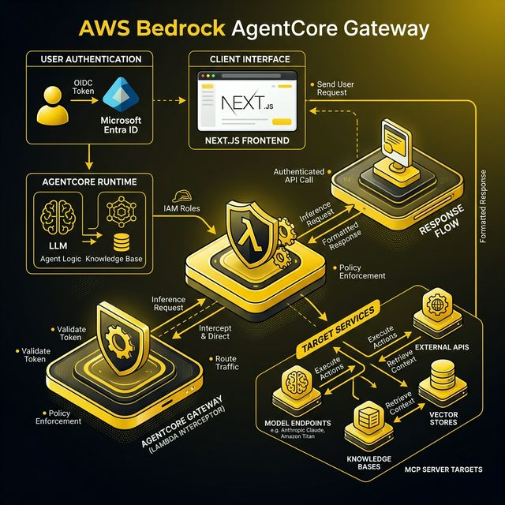
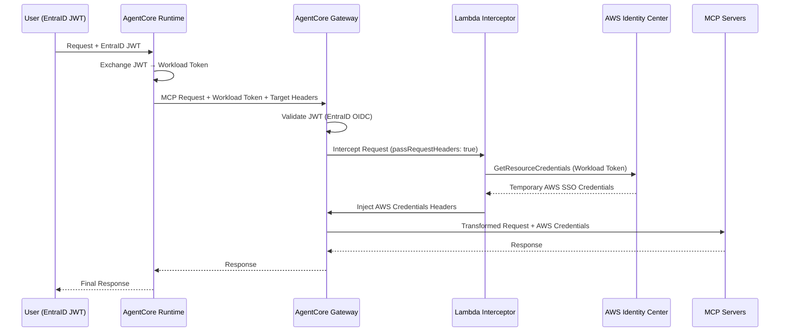

# Bedrock AgentCore Terraform Infrastructure

Production-ready Terraform infrastructure for deploying Amazon Bedrock AgentCore with Token Propagation and Just-in-Time (JIT) Credential Generation.

## Overview

This infrastructure enables secure, multi-account AWS resource access through a Gateway-Runtime architecture where EntraID JWT tokens are exchanged for AgentCore Workload Tokens, then transformed into temporary AWS SSO credentials via a Lambda Request Interceptor.

## Architecture





## Token & Credential Flow

The JIT credential generation requires specific token validations and headers to be passed correctly from the frontend/runtime out to the targeted MCP servers.

### 1. EntraID JWT Validation (The Claims)
The user authenticates with EntraID and receives an OIDC JWT. This JWT must meet the following claim requirements to be accepted by the AWS Trusted Token Issuer (TTI) and Gateway Authorizer:
- **`iss`** (Issuer): Must match the configured `entra_oidc_issuer_url` (your Entra tenant).
- **`aud`** (Audience): Must match the configured `entra_audience` (typically your Entra App Registration Client ID).
- **Identity Claim Mapping (`sub`, `email`, or `upn`)**: The EntraID token must contain a claim that maps 1:1 to a user provisioned inside AWS IAM Identity Center (IDC). Often, this is the user's `email` or User Principal Name (`upn`). AWS IDC uses this aligned claim to identify the user requesting the JIT credentials.

### 2. Runtime Token Exchange
The AgentCore Runtime receives the EntraID JWT and exchanges it for a **Workload Token** using the deployed Workload Identity and TTI configurations. 

### 3. Forwarding to the Gateway (Passing Headers)
When the Next.js frontend / AgentCore Runtime makes a request to the targeted AgentCore Gateway MCP endpoint, it configures the target AWS environment using headers:
- **`Authorization`**: The exchanged `Bearer <workload-token>`.
- **`x-target-account-id`**: The AWS 12-digit Account ID where the target role resides.
- **`x-target-role-name`**: The name of the AWS IAM Role (typically an IDC Permission Set role) the user wants to assume.

*Note: The frontend allows users to dynamically select their account and role via a dropdown. These selections are passed down to the `strands-agents` runtime, which injects them as the `x-target-*` headers for the MCP Gateway.*

### 4. Lambda Interceptor Conversion
The Gateway validates the token. Because `pass_request_headers` is enabled, all original headers are pushed into the **Lambda Interceptor**. The Interceptor extracts the trio (`Authorization`, `x-target-account-id`, `x-target-role-name`) and triggers the `bedrock-agentcore:GetResourceCredentials` API. 

AWS IDC evaluates the user (mapped from the token) against the requested account/role. **If the user is authorized for that Permission Set in that Account**, AWS successfully returns AWS STS temporary SSO keys. The interceptor injects these keys (`x-aws-access-key-id`, `x-aws-secret-access-key`, `x-aws-session-token`) into the request, and the Gateway routes it to the MCP endpoint.
For details on how AgentCore MCP Servers are integrated, the `streamable-http` transport requirements, and handling multi-tenant credential injection inside your targets, please read the **[MCP Server Requirements & Integration Guide](MCP.md)**.

## External System Requirements

#### Microsoft Entra ID (Azure AD)
1. **App Registration:** You must create an App Registration for your Next.js application. The `Client ID` from this app becomes your `entra_audience` variable.
2. **Token Claims:** Ensure the App Registration is configured to emit the expected mapping claim (e.g., `email` or `upn`) in the OIDC JWT token.

#### AWS IAM Identity Center (IDC)
1. **User Synchronization:** AWS IDC must be connected to your Entra ID tenant (typically via SCIM/SAML). The users logging into your frontend *must physically exist* in AWS IDC so they can be securely mapped.
2. **Permission Sets & Account Assignments:** AWS IDC will only generate JIT credentials if the mapped user actually has access to the target. You must grant the users access to the specific AWS Accounts and IAM Roles (Permission Sets) they intend to select in the frontend dropdown. If a user requests an `account_id` + `sso role` they aren't assigned to in IDC, the credential generation will be denied.

## Prerequisites

- Terraform >= 1.5.0
- AWS CLI configured with appropriate credentials
- AWS IAM Identity Center instance configured
- Microsoft Entra ID tenant with OIDC configured

## Module Structure

```
.
├── main.tf                      # Root module orchestration
├── variables.tf                 # Input variable definitions
├── outputs.tf                   # Output value definitions
├── terraform.tfvars.example     # Example variable values
├── modules/
│   ├── iam/                     # IAM roles for Runtime and Interceptor
│   ├── bedrock-identity/        # Workload Identity, Credential Provider, TTI
│   ├── lambda/                  # Lambda interceptor deployment
│   └── gateway/                 # Gateway configuration and routing
├── scripts/
│   └── validate_infrastructure.py  # Post-deploy validation script
└── examples/
    └── basic/                   # Complete working example
```

## Quick Start

1. Copy the example variables file:
   ```bash
   cp terraform.tfvars.example terraform.tfvars
   ```

2. Edit `terraform.tfvars` with your configuration values

3. Initialize Terraform:
   ```bash
   terraform init
   ```

4. Review the execution plan:
   ```bash
   terraform plan
   ```

5. Apply the configuration:
   ```bash
   terraform apply
   ```

6. Validate the deployment:
   ```bash
   python3 scripts/validate_infrastructure.py \
     --region us-east-1 \
     --account-id 123456789012
   ```

## Configuration

See `terraform.tfvars.example` for all required variables and their descriptions.

### Required Variables

| Variable | Description | Example |
|----------|-------------|---------|
| `aws_region` | AWS region for deployment | `us-east-1` |
| `aws_account_id` | 12-digit AWS account ID | `123456789012` |
| `entra_tenant_id` | Microsoft Entra ID tenant UUID | `a1b2c3d4-...` |
| `entra_oidc_issuer_url` | Entra ID OIDC discovery endpoint | `https://login.microsoftonline.com/{tenant}/v2.0` |
| `entra_audience` | Expected JWT audience value | `api://bedrock-agentcore-gateway` |
| `idc_instance_arn` | IAM Identity Center instance ARN | `arn:aws:sso:::instance/ssoins-...` |
| `workload_identity_name` | Name for Workload Identity | `my-strands-agent` |
| `credential_provider_name` | Name for Credential Provider | `aws-idc-provider` |
| `gateway_name` | Name for Gateway | `agentcore-gateway` |
| `interceptor_lambda_name` | Name for Lambda function | `agentcore-interceptor` |
| `mcp_targets` | List of MCP server targets | See `terraform.tfvars.example` |

## Outputs

After successful deployment, the following outputs are available:

- `runtime_execution_role_arn` — IAM role ARN for Runtime
- `interceptor_execution_role_arn` — IAM role ARN for Interceptor
- `tti_arn` — Trusted Token Issuer ARN
- `workload_identity_arn` — Workload Identity ARN
- `credential_provider_arn` — Credential Provider ARN
- `lambda_function_arn` — Lambda function ARN
- `gateway_arn` — Gateway ARN
- `gateway_endpoint_url` — Gateway endpoint URL
- `infrastructure_state` — Complete map of all resource ARNs

## Security

This infrastructure follows AWS security best practices:

- Least privilege IAM permissions
- No wildcard resource permissions without strict conditions
- JWT-based authentication for Gateway (CUSTOM_JWT authorizer)
- Temporary credentials with limited validity (JIT generation)
- Request header propagation for credential generation
- No sensitive values logged by the Lambda interceptor

## Troubleshooting

| Issue | Cause | Resolution |
|-------|-------|------------|
| Gateway stuck in CREATING | Interceptor Lambda not ready | Ensure Lambda is Active before Gateway creation |
| `GetResourceCredentials` fails | Credential Provider not linked to IDC | Verify `idc_instance_arn` is correct |
| JWT validation fails | Wrong OIDC issuer URL or audience | Check `entra_oidc_issuer_url` and `entra_audience` |
| Lambda permission denied | Missing resource-based policy | Verify `AllowBedrockGatewayInvoke` permission exists |
| Missing headers in interceptor | `pass_request_headers` not enabled | This is set to `true` by default in this module |

## License

See LICENSE file for details.

